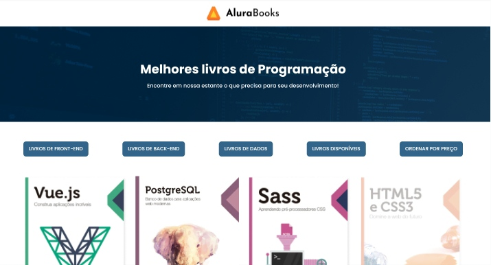

<h1 align="center">Alura Books </h1>

  

Projeto front-end focado no desenvolvimento com JavaScript: métodos de array

## Tecnologias utilizadas durante o curso
* JavaScript

## Tecnologias utilizadas no projeto
* HTML
* CSS

## Screenshots
